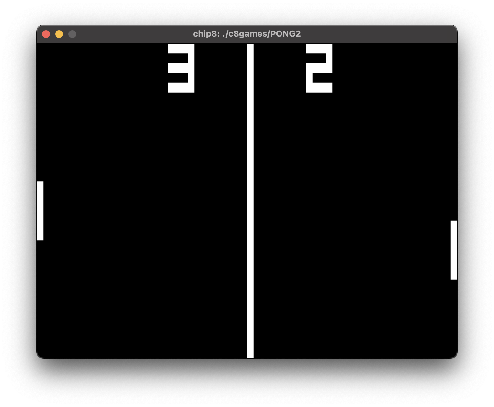
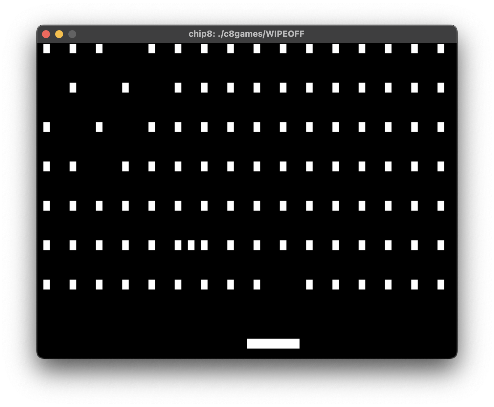
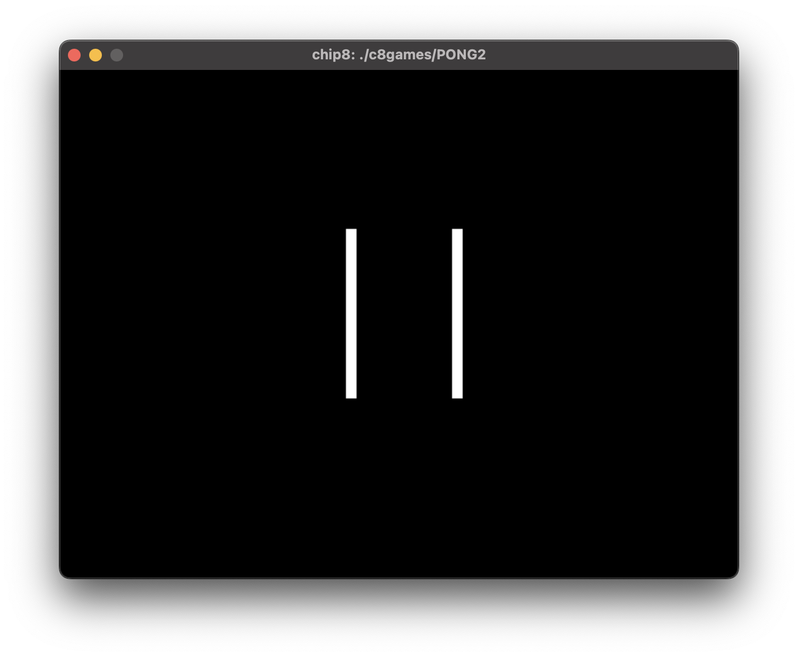

# jchip8-rs

`jchip8-rs` implements the CHIP-8 interpreted programming language from the 1970's. CHIP-8 provides a description of the virtual machine that it runs on, and
`jchip8-rs` emulates this machine well enough to run many original games for the system
(23 public domain games are included in `/c8games`). It is a port of [chip8](https://github.com/jugonz/chip8), a CHIP-8 emulator I wrote in Go about ten years ago, and has taught me a lot about the Rust language.

`jchip8-rs` is written in Rust and uses SDL2 to display graphics. It relies on
the `rust-sdl2` crate for SDLv2 support. With an SDL2 installation, `jchip8-rs` should be able to run on most systems that are supported by the Rust environment.

`jchip8-rs` was mostly written in Fall 2024 as a hobby project, but its source code should be clean enough for consumption by other humans.

After it is built, it can be run via
	`jchip8-rs --path "path/to/chip8/rom"`.

Debug mode can be turned on via the `--debug` flag, which will enable logging.

`jchip8-rs` uses a hex keyboard, mapped directly to keys `0-9` and `A-F`. Gameplay can be paused with `P`, and quit with `Q`. (This can be changed at the top of `gfx/hardware.rs`.)

Happy emulating!

## Screenshots

## Features

`jchip8-rs` supports rudimentary save-states. If the `--save-state "path/to/save/state"` argument is passed at startup, gameplay can be saved to `path/to/save/state` (while not paused) by pressing `S`. To load a game state, start `jchip8-rs` with the `--load-state "path/to/load/state"` argument. (Both `--save-state` and `--load-state` can be passed at the same time, and are allowed to point to the same state, for easy continuation of a game.) Note that for simplicity, `jchip8-rs` game states include the full game being played, so `--path` should not be provided when starting a game from a save-state.

## Acknowledgements
This project relies upon the `clap` (argument parsing), `rand`, `rust-sdl2`, `serde`, `serde-json`, and `serde-with` (save-state handling) crates. Licenses for them (and SDL2) are provided in `/third-party`.

## License

[MIT](LICENSE.md)

